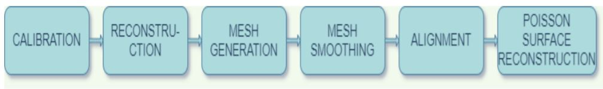
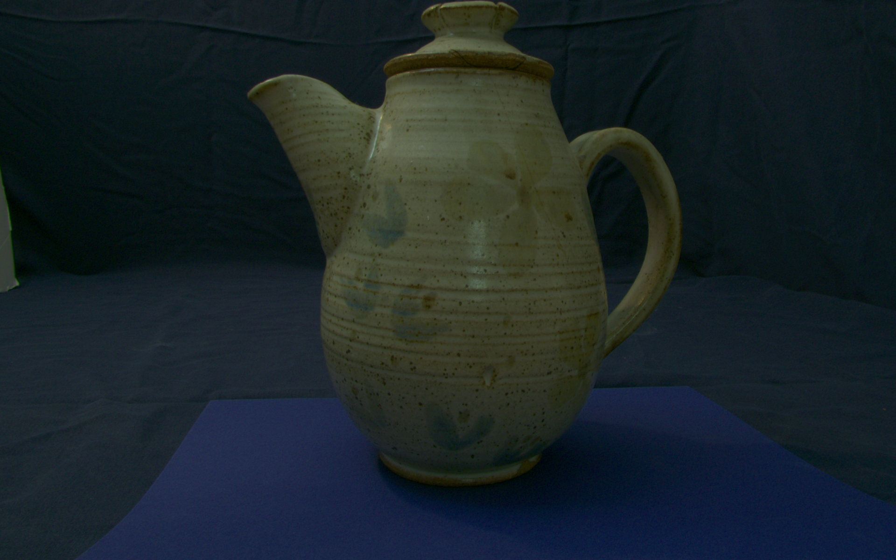
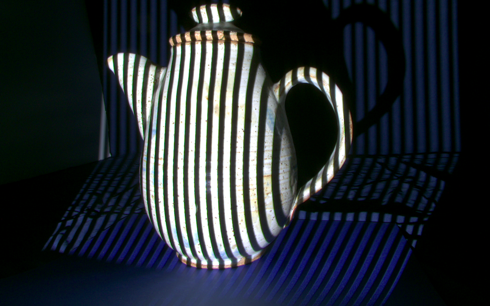
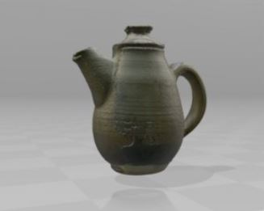

# 3D-Model-Reconstruction

## Overview
The primary goal of this project is reconstructing a three dimensional 
model from two dimensional structured light scans of a teapot. The image set was created by producing 
structured lights on to the object, to get the grey code, and match the points from the camera 
from the angles left and right. These images are manipulated to generate mesh and reconstruct the meshes into one 3D
model. Implemented core software components for calibration, bounding box pruning, neighbor smoothing, triangulation, mesh smoothing, mesh generation, mesh cleaning, and combining meshes. Performed visualization in 3D and 2D views. Used MeshLab software for mesh alignment and Poisson Surface reconstruction.

## Project Pipeline

## Results
#### Sample 2D Image Scan

#### Final 3D model

